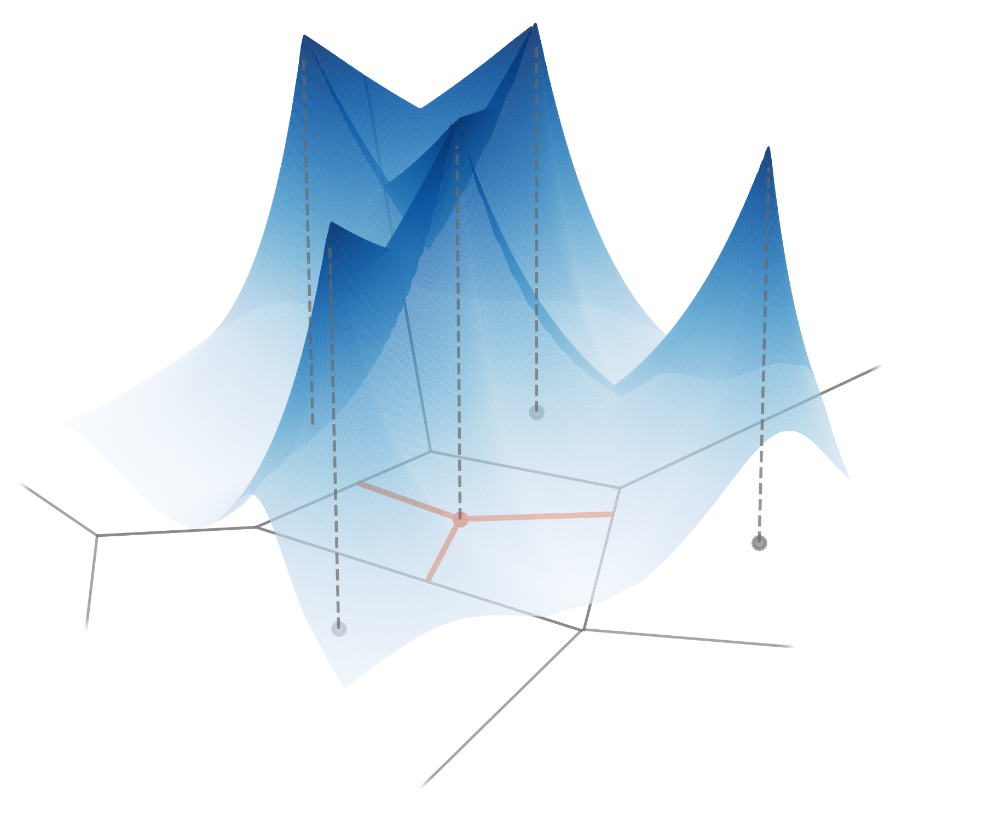

# Radial Voronoi Density Estimation



## Initial setup
The setup corresponds to that of the main competitive method CVDE. 

### RVDE
The core part of the method is written in C++ with a Python interface. Below is the instruction to compile the code within a conda environment that will later be used for the experiments.

`environment.yml` contains requirements both for the main code and for the provided experiments.

```shell
# Create a conda environment following the requirements
conda env create -f environment.yml
conda activate rvde

# Compile the VDE sources
mkdir build && cd build
cmake CMAKE_TOOLCHAIN_FILE=conda-toolchain.cmake ..
make

# Copy the library to the experiments folder
cp vgt.so ../experiments/

# Switch to experiments directory
cd ../experiments/
```

We provide our own implementations of KDE and Adaptive KDE, the source code of which is available in `vgt/extra/KDE.{cpp|h}`.

Optionally, the original version of Adaptive KDE without data normalization is provided in the _experiments/awkde_ folder and can be installed from the terminal with the command `pip install pybind11 ; pip install -e ./awkde `. 

## API brief description
Python files in the _experiments_ folder:
 - **distributions.py** contains all data distributions used in the paper.
 - **embeddings.py** provides data transformations; `None` and `Resize` are used in the paper.
 - **estimators.py** provides an interface to access the density estimators. `Orig_KDE` and `Orig_AWKDE` correspondingly rely on the implementation from scikit-learn or on the original implementation. All other implementations use the library compiled earlier. 

Different kernels are available in the compiled library, such as:
- the exponential kernel `LaplaceCellKernel(dim, bandwidth)`;
- the rational kernel `PolynomialCellKernel(dim, bandwidth, k)`;
- the Gaussian kernel `GaussianCellKernel(dim, bandwidth)`. 

For the RVDE, `BalancedExponentialCellKernel(dim, alpha, 1.)` and `BalancedPolynomialCellKernel(dim, alpha, k)` are used instead.

All kernels have `.latex()` command that returns the latex code for the formula of the kernel.

## Experiments
The experiments from Figure 7 from the paper can be run via the bash scripts from the _experiments_ folder. 
The scripts are: `single_gaussian.sh`, `gaussian_mixture.sh`, `anuran_calls.sh`, `mnist.sh`. 
Running either of them in the terminal will produce a corresponding figure in the _experiments/images_ folder.

